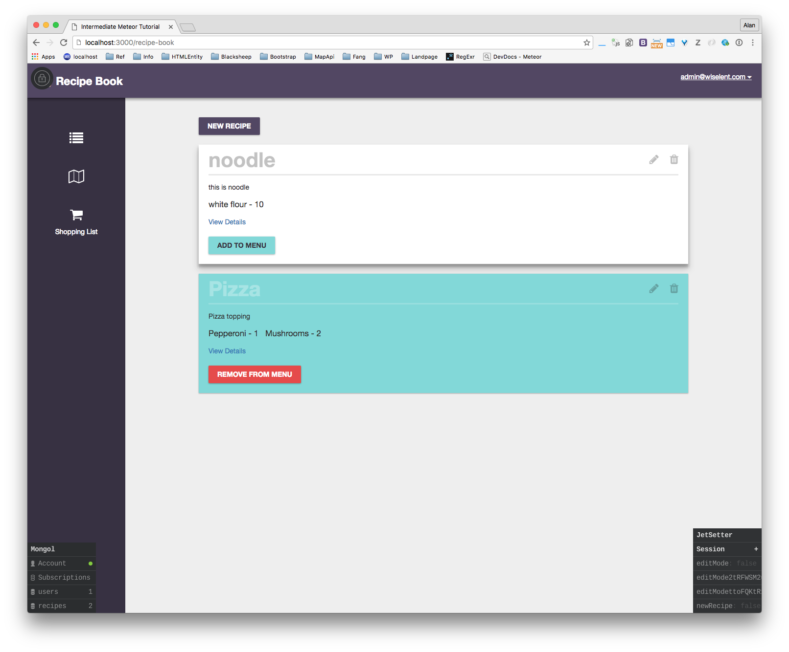
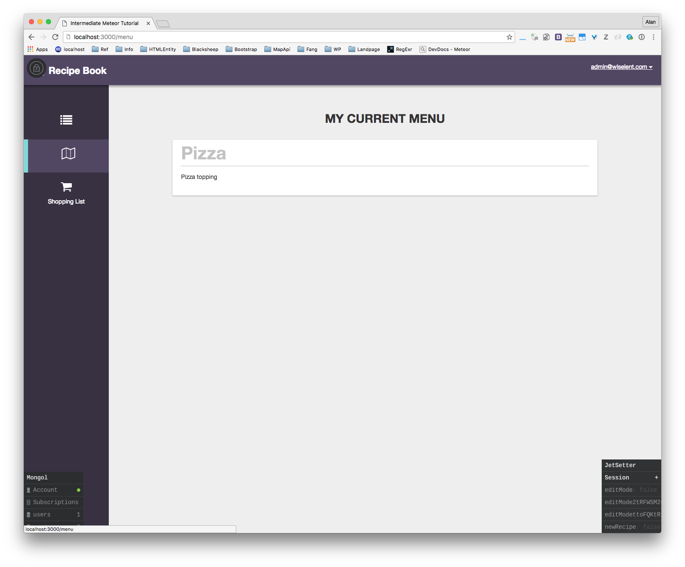

# README

Author: Lin Dong

Date: Sat May 14 16:17:30 PDT 2016

## Intermediate Meteor

1. Learning form [Intermediate Meteor](https://www.youtube.com/playlist?list=PLLnpHn493BHFYZUSK62aVycgcAouqBt7V)

2. `meteor` or `meteor --settings ../settings.json`

3. Check out `.meteor/packages` to see what packages were installed

# Screenshots

